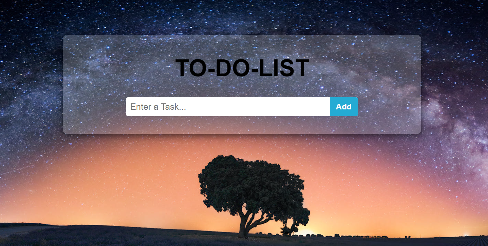
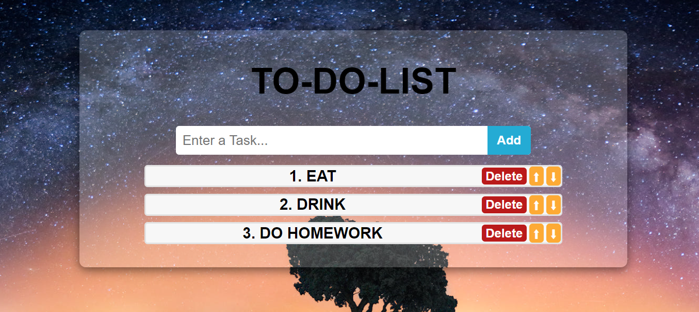

# To-Do-List
This is a simple To-Do List application built using React.js. It allows users to:
- Add new tasks to a list.
- Delete tasks.
- Reorder tasks by moving them up or down in the list. 
 
Features
Add Task: Users can add new tasks by typing in the input field and clicking the Add button.
Delete Task: Each task has a Delete button that removes the task from the list.
Reorder Tasks: Tasks can be moved up or down using the Up and Down buttons, allowing users to prioritize tasks.
Task Display: Tasks are numbered and displayed in the order they are added or rearranged.
 
Screenshots

 
